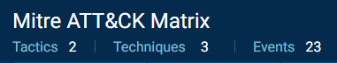
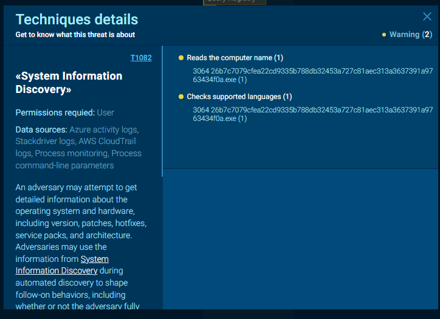

# SFileRansomware
### Subtitle: samples/Families/SFileRansomware/

*26b7c7079cfea22cd9335b788db32453a727c81aec313a3637391a9763434f0a*

---
### Navigation

----
**Sorce files:**
SHA-256 Hash --> 26b7c7079cfea22cd9335b788db32453a727c81aec313a3637391a9763434f0a

---
**Static analyze**

Check virus totla for info:

https://www.virustotal.com/gui/file/26b7c7079cfea22cd9335b788db32453a727c81aec313a3637391a9763434f0a

From any run info

This is ransomware trying to encrypt files

---
**Thanks**: vx-underground.org
**Links:** https://samples.vx-underground.org/samples/Families/SFileRansomware/

---
[Thanks](../../../notes/Thanks_page.md),
George K.

---